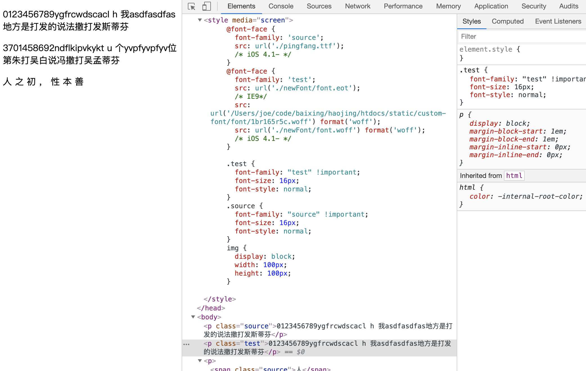

# trouble-maker

随机生成不同文字映射字库文件，例如：正常字库文件 source.ttf 中 `的` unicode 是 `\u7684`，那么随机生成的 font.ttf 中 unicode 可能是 `\u8862` 或者其他随机值。

当通过浏览器加载字库并设置字体 `font-family` 之后，原文中 “的” 不一定会再显示为 “的”。



## 使用

```shell
$ npm install
$ node index.js
```

## 目录说明

```shell
├── font-carrier
│   ├── lib
│   ├── package.json
│   └── readme.md
├── index.html
├── index.js
├── newFont
│   ├── font.eot
│   ├── font.json
│   ├── font.svg
│   ├── font.ttf
│   ├── font.woff
│   └── font.woff2
├── node_modules
├── package.json
└── source.ttf
```

- newFont：生成的随机字库，`font.json` 为变更的文字映射，key 为显示值，value 为实际值
- index.js：生成字库的核心代码
- font-carrier：生成器，该 SDK 有做代码调整，请勿使用 NPM 下的 font-carrier 库
- index.html：示例文件
- source.ttf：原字库文件

## 文字映射规则

通过观察 `index.js` 我们可以得知文字映射分为四组：

```javascript
[
    "0123456789",
    "abcdefghijklmnopqrstuvwxyz",
    "ABCDEFGHIJKLMNOPQRSTUVWXYZ",
    "的一二三四五六七八九拾百千是了我不人在他有这个上们来到时大地为子中你说生国年着就那和要她出也得里后自以会家可下而过天去能对小多然于心学么之都好看起发当没成只如事把还用第样道想作种开美总从无情己面最女但现前些所同日手又行意动期它头经长儿回位分爱老因很给名法间斯知世什两次使身者被已亲其进此话常与活正感王李张刘陈杨黄赵吴周徐孙马朱胡郭何高林郑谢罗梁宋唐许韩冯邓曹彭曾萧田董袁潘蒋蔡余杜叶程苏魏吕丁任沈姚卢姜崔钟谭陆汪范金石廖贾夏韦付方白邹孟熊秦邱江尹薛闫段雷侯龙史陶黎贺顾毛郝龚邵万钱严覃武戴莫孔向汤"
]
```

其中字符 unicode 只会在当前组内发生交换，举个例子：

"0" => "a" 这种情况是不可能出现的。这种设置是为了生成更不易识别的混乱文字，谁能想到 `QQ: 31241241` 原来是 `QQ: 17047047` ？

## 如何生成了字库？

详见 [purplebamboo/font-carrier](https://github.com/purplebamboo/font-carrier)
